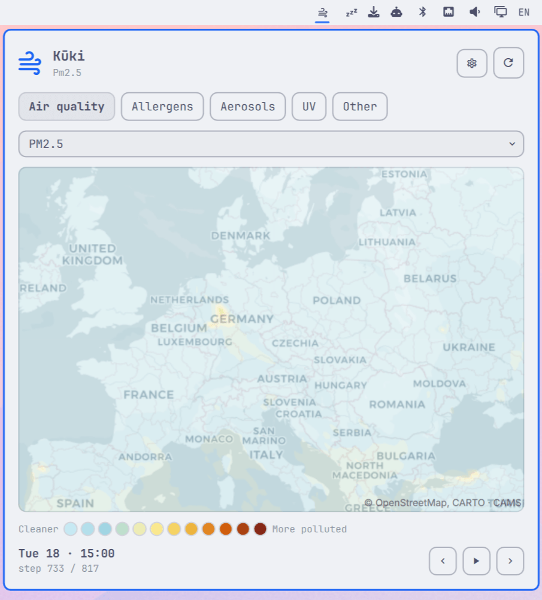

# Kūki

Air quality, pollen, aerosol, and UV forecast maps on the Omarchy Quattro bar, from Copernicus CAMS.

*Kūki* (空気) is Japanese for "air."



Click the wind icon in the bar to open an interactive slippy map of Copernicus
Atmosphere Monitoring Service (CAMS) forecast layers. Pan and zoom, step through
the forecast hour by hour or play it, and switch between air quality, allergens,
aerosols, and UV.

## Features

- **Four curated categories** - **Air quality** (PM2.5, PM10, O₃, NO₂, SO₂, CO),
  **Allergens** (birch, grass, ragweed, olive, alder, mugwort), **Aerosols** (total AOD,
  dust, wildfire smoke, sea salt, sulphate), and **UV**. An **Other** tab searches
  any of the ~95 public CAMS layers, including the technical ones (fire radiative
  power, upper-air and greenhouse gases, …).
- **Works worldwide** - inside Europe the map uses CAMS's high-resolution regional
  forecast; everywhere else it falls back to the coarser global CAMS model
  automatically (picked from your system timezone, no location picker). Allergens
  is Europe-only pollen, so its tab is disabled outside Europe.
- **Interactive map** - theme-aware light/dark basemap, drag to
  pan, wheel to zoom.
- **Forecast time** - a scrubber with prev/next and a play button that
  auto-advances (paced to the network so frames never lag). Opens on the step
  nearest the current time.
- **Minimal legend** - a discrete swatch strip below the map with
  category-appropriate ends ("Cleaner → More polluted", "Less pollen → More
  pollen", …).
- **Allergen index or concentration** - toggle each pollen species between the
  banded EEA index and raw grains/m³.
- **Per-category layer checklist** - tick which layers appear in a category's
  picker; remembered per category.
- **Settings** (⚙) - overlay opacity, per-layer style, and the layer checklist.
- **Opens on your country** - the first-run map centre comes from your system
  timezone (fully offline, no IP geolocation).
- **Bar tooltip** - hover the icon to see the current value and level at your
  home location (e.g. "PM2.5 6.4 µg/m³ · Low").
- **Remembers everything** - last layer per category, view, time, opacity, and
  the layer checklist all persist across restarts.

## Install

```sh
omarchy plugin add https://github.com/cossssmin/kuki.git --enable
```

If needed, add it to the bar explicitly:

```sh
omarchy bar plugin add kuki --section right
```

## Remove

```sh
omarchy plugin remove kuki
```

Or just disable it, keeping it installed:

```sh
omarchy plugin disable kuki
```

To also clear its saved state and cache:

```sh
rm -rf ~/.config/omarchy/kuki
```

## Usage

Click the wind icon to open the panel. Pick a **category** chip, then a **layer**
from the dropdown. Drag the map to pan, scroll to zoom. Step the forecast with
the arrows or hit play. Open **⚙** for opacity, style, and the layer checklist.

### Keyboard

| Key | Action |
|-----|--------|
| `Space` | Play / pause the forecast |
| `←` / `→` | Previous / next time step |
| `↑` / `↓` | Previous / next layer in the category |
| `Ctrl`+`←` / `Ctrl`+`→` | Switch category |
| `Esc` | Close |
| `Tab` | Move to the neighbouring bar panel |

## Requirements

- Omarchy 4 "Quattro" shell (Quickshell).
- `python3` (standard library only; the helper fetches and parses the CAMS
  capabilities, legends, and point values).
- Network access for the basemap tiles and the CAMS WMS. Capabilities are cached
  locally and refreshed at most every 6 hours.

No QtLocation is required; the map is hand-rolled.

## Dependencies

- **No third-party packages.** Nothing to `npm` or `pip` install. The QML runs on
  the Omarchy/Quickshell runtime; the Python helper uses only the standard library.
- **External services** (network): the CAMS WMS at `eccharts.ecmwf.int` and the
  CARTO basemap tiles at `basemaps.cartocdn.com`.

## Configuration

Kūki reads and writes only its own files under `~/.config/omarchy/kuki/`
(`state.json`, `caps.json`). It never modifies your Hyprland, shell, or any other
configuration. Bar placement is handled by the `omarchy` CLI when you enable it.

## Data & attribution

- Forecast data: **Copernicus Atmosphere Monitoring Service (CAMS)** via the
  public ECMWF WMS (`eccharts.ecmwf.int/wms?token=public`).
- Basemap: **© OpenStreetMap contributors, © CARTO**.

## License

MIT. See [LICENSE](LICENSE).
